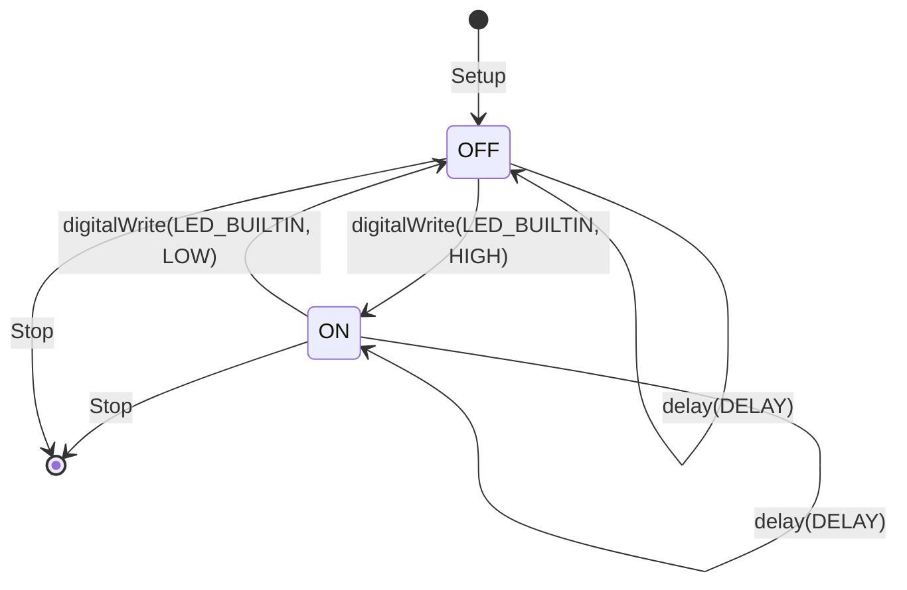

# Practica 1:
En esta primera práctica junto con la placa ESP32---- LED parpadea cada 1s

```mermaid
stateDiagram
    [*] --> OFF: Setup
    OFF --> ON: digitalWrite(LED_BUILTIN, HIGH)
    ON --> OFF: digitalWrite(LED_BUILTIN, LOW)
    ON --> ON: delay(DELAY)
    OFF --> OFF: delay(DELAY)
    ON --> [*]: Stop
    OFF --> [*]: Stop
```
