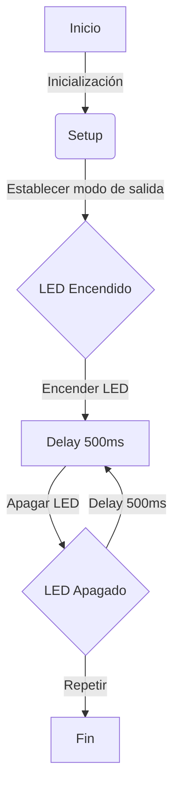
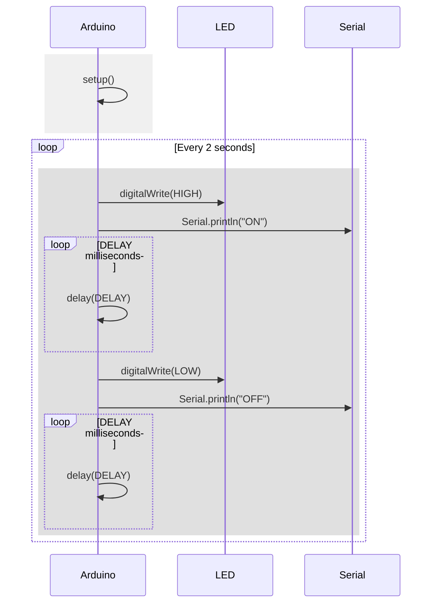

# Practica 1: BLINK 
En esta primera práctica junto con el microcontrolador ESP32 y un led, tendremos como objetivo producir el parpadeo del LED.

# 1.Codigo Básico:
```c++
#define LED_BUILTIN 2
#define DELAY 500

void setup() {
 pinMode(LED_BUILTIN, OUTPUT);
}
void loop() {
 digitalWrite(LED_BUILTIN, HIGH);
 delay(DELAY);
 digitalWrite(LED_BUILTIN, LOW);
 delay(DELAY);
}
```
# 2. Modificar el programa (ON, OFF)

```c++
#include <Arduino.h>

#define LED_BUILTIN 23
#define DELAY 1000 //ms


void setup() {
Serial.begin(115200); 
pinMode(LED_BUILTIN, OUTPUT);

}

void loop() {
    
digitalWrite(LED_BUILTIN, HIGH);

Serial.println("ON"); 
delay(DELAY);
digitalWrite(LED_BUILTIN, LOW);

Serial.println("OFF"); 
delay(DELAY);
}
```
En este código modificado hemos añadido los puertos de salida ON y OFF, con las funciones sugeridas en la práctica (Serial.printIN), aparte de esta modificación tambien se ha cambiado el tiempo de espera del LED de 500 a 1000 milisegundos.

# 3. Modificar programa para que actue en los registros de entrada de salida.
```c++
#include <Arduino.h>

#define LED_BUILTIN 23
#define DELAY 1000

#define GPIO_OUT_REG 0x3FF4400C

void setup() {
  Serial.begin(115200);
  pinMode(LED_BUILTIN, OUTPUT);
}

void loop() {
  volatile uint32_t *gpio_out = (volatile uint32_t *)GPIO_OUT_REG;

  *gpio_out |= (1 << LED_BUILTIN);
  digitalWrite(LED_BUILTIN, HIGH);

  Serial.println("ON");
  
  delay(DELAY);

  *gpio_out ^= (1 << LED_BUILTIN);
  digitalWrite(LED_BUILTIN, LOW);

  Serial.println("OFF");

  delay(DELAY);
}
```
En este código proporcionado, se ha modificado respecto a los anteriores, para que haga la función de actuar sobre los registros de entrada y salida, el código ha sido diseñado con las sugerencias añadidas que hacen referencia a *gpio_out*


# 4. Medir frecuencia máxima 
En este cuarto apartado de la práctica modificaremos el Pin de la salida a otro que esté libre i con la ayuda de un osciloscopio mediremos la frecuencia máxima de apagado y encendido que nos marque. 
Mediremos la frecuencia en 4 ocasiones distintas:

## 4.1 Con el envio por puerto série del mensaje y utilizando las funciones del Arduino

```c++
 #include <Arduino.h>

   int led = 14; 

   void setup() {                
      pinMode(led, OUTPUT);   
      Serial.begin(115200);
   }

   void loop() {
      Serial.println("ON");
      digitalWrite(led, HIGH);
      Serial.println("OFF");      
      digitalWrite(led, LOW);
   }
   ```
Hemos definido el pin de salida en el pin 14, respecto a la frecuencia registrada en el osciloscopio es de 29.81 Khz.

## 4.2 - Con el envio por puerto série y accediendo directamente a los registros:

```c++
 #include <Arduino.h>

   int led = 14;
   uint32_t *gpio_out = (uint32_t *)GPIO_OUT_REG;

   void setup() {                
      pinMode(led, OUTPUT);   
      Serial.begin(115200);
   }

   void loop() {
      Serial.println("ON");
      *gpio_out |= (1 << led);
      Serial.println("OFF");      
      *gpio_out ^= (1 << led);
   }
```
En este caso anterior con le pin de salida en el 14, hay registrada una frecuencia de 29.77 Khz.

## 4.3 - Sin el envio por el puerto série del mensaje i utilizando las funciones de Arduino

```c++
#include <Arduino.h>
int led = 14; 

void setup() {                
   pinMode(led, OUTPUT);   
}

void loop() {
   digitalWrite(led, HIGH);
   digitalWrite(led, LOW);
}
```
En este tercer caso se registra una frecuencia en el osciloscopio de 1.72 Mhz.

## 4.4 - Sin el envio por el puerto série y accedirendo directamente a los registros

```c++
#include <Arduino.h>

int led = 14; 
uint32_t *gpio_out = (uint32_t *)GPIO_OUT_REG;

void setup() {                
   pinMode(led, OUTPUT);   
}

void loop() {
   *gpio_out |= (1 << led);
   *gpio_out ^= (1 << led);
}
```
Y en este último caso se registra una frecuencia de 4.701 Mhz en el osciloscopio.

# 5. Diagrama de flujo i diagrama de tiempo.

A continuación se proporciona el diagrama de flujo i el diagrama de tiempo, tomando como ejempo el código básico proporcinado en el punto 1 de esta pràctica.

## 5.1 - Diagrama de flujo.

En el diagrama de flujo se muestra el funcionamiento del codigo

  1- Se inicia , se establece el modo de salida.

  2- El LED se enciende, pasa el tiempo del DELAY (en este caso he tomado como ejemplo 500ms) y se apaga.

  3- Una vez apagado, vuelve a pasar el tiempo del DELAY y en este caso se enciende.

## 5.2- Diagrama de tiempo.

PONER OTRO DIAGRAMA DE TIEMPO
___-----------------------EXPLICACION ...___DSAK

# 6 - Tiempo libre del procesador
Tomando como ejemplo el programa de código básico con un DELAY de 500 ms.
El tiempo libre del microprocesador sería de 1000 milisegundos o también se le podría decir de 1 segundo.

Explicación:
Vemos que el DELAY está definido a 500 milisegundos, esto significa que 500 milisegundos para enceder el Led y otros 500 milisegundos al apagar).
Llegamos a la conclusión que cada 1 segundo el microprocesador no realiza ninguna tarea mientras enciende y apaga el Led.